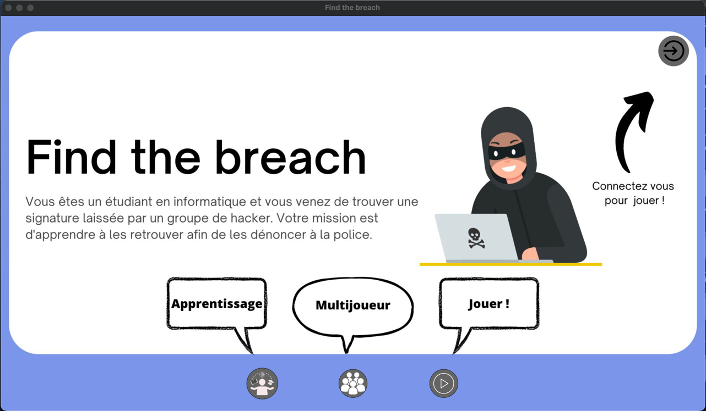
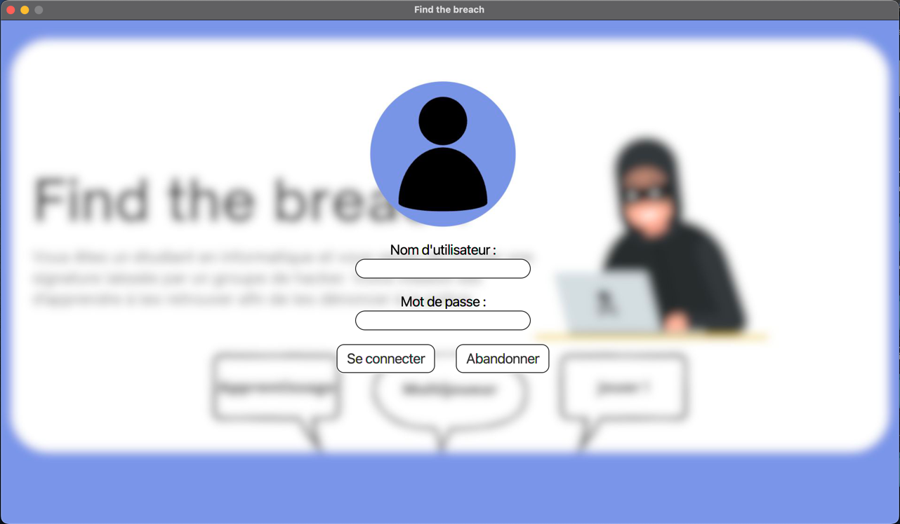
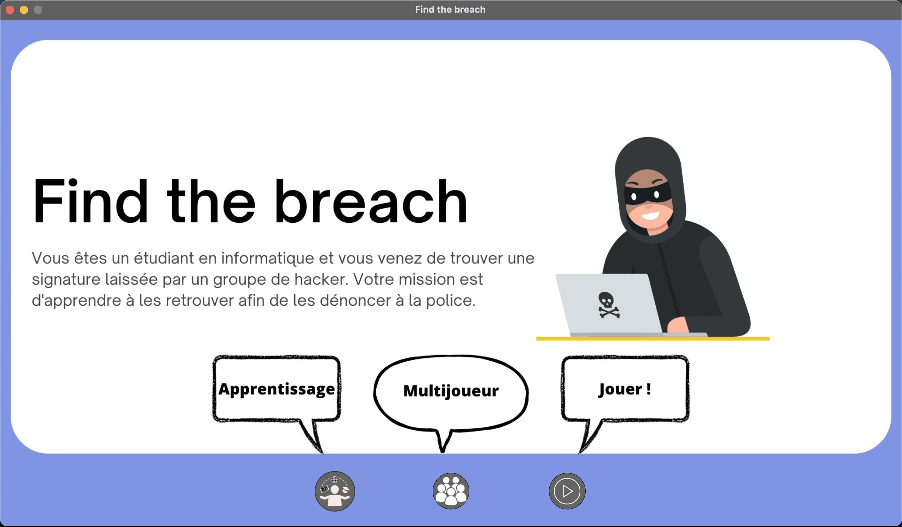
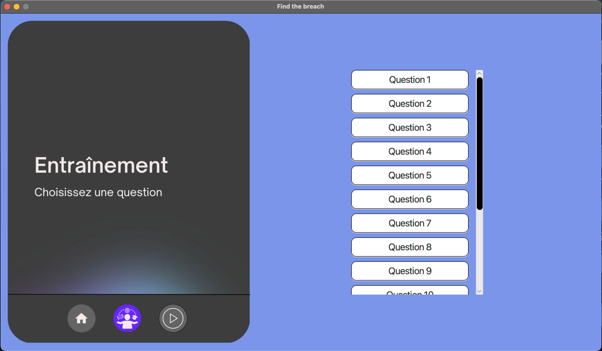
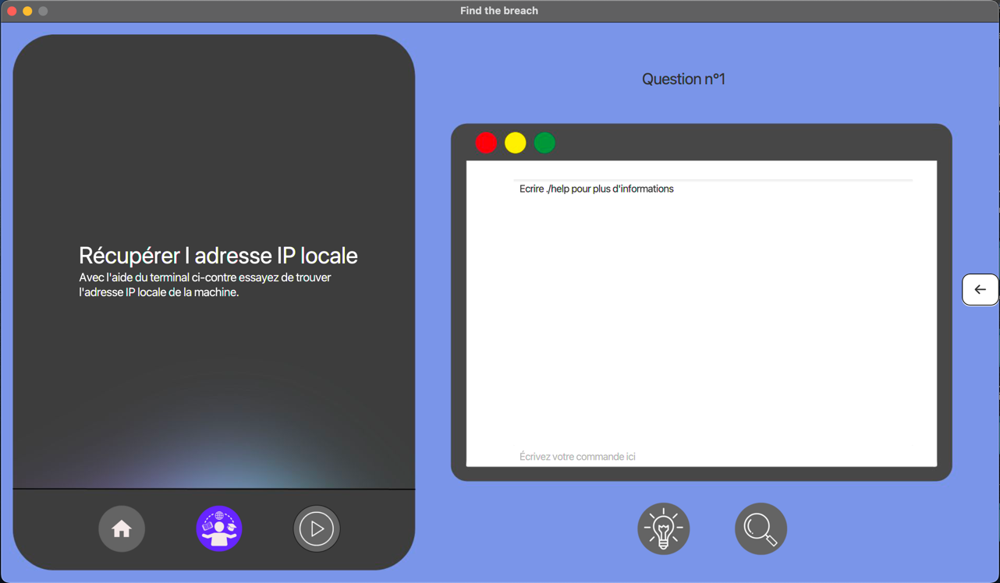
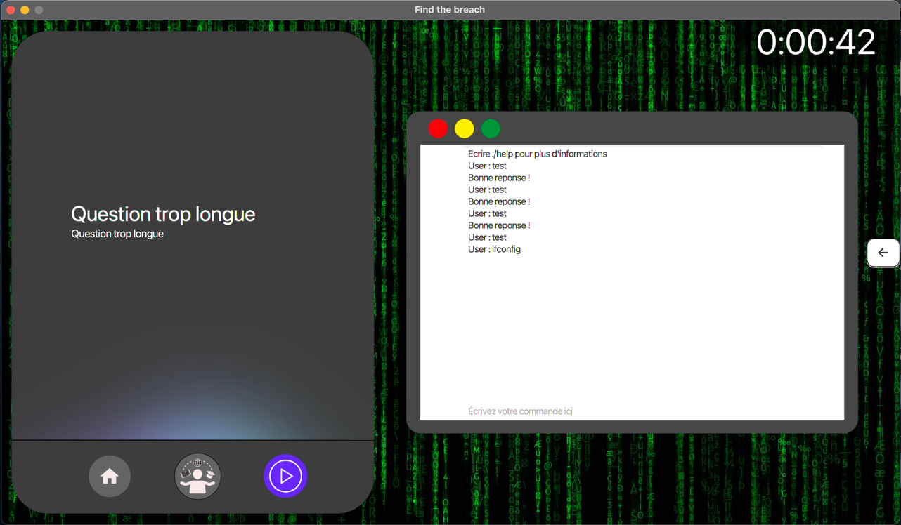
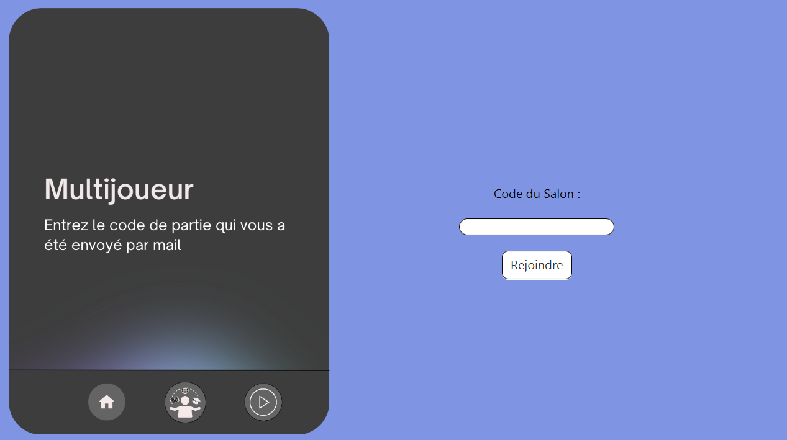
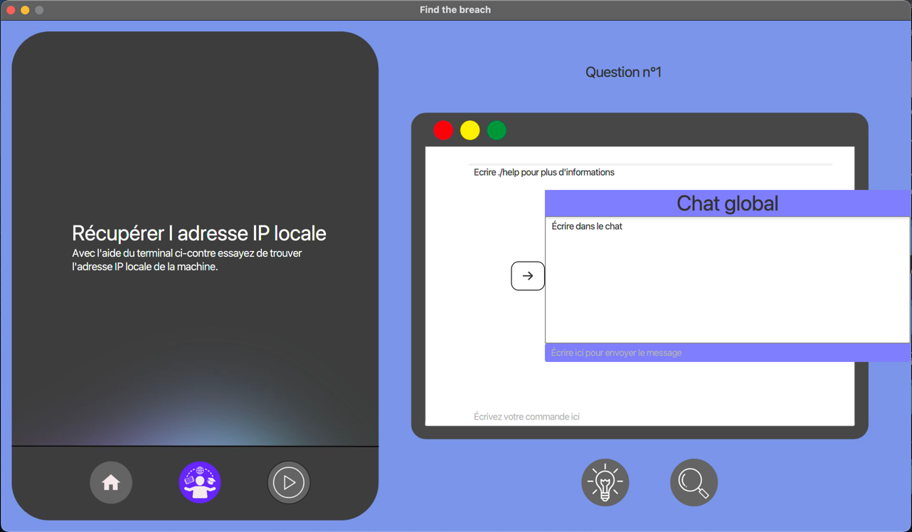

# SAE S3 - FindTheBreach 
[](https://forthebadge.com)</br>
Projet universitaire visant à la création d'un serious game sur les réseaux, évolutif.</br>
Nous avons choisi un scénario afin de rendre l'application plus attrayante :</br></br>
Vous êtes un étudiant en informatique et vous venez de trouver une signature laissée par un groupe de hacker.
Votre mission est de les retrouver afin de les dénoncer à la police.

## Demandes ✍️

- Jeu qui sert de support pour les cours
- Site web pour administrer le contenu du jeu -> Site accessible sur https://findthebreach.ddns.net et code sur le Github : https://github.com/SAE-S3-4/Site
- Utilisation des sockets

## Ce que nous avons réalisé ⚙️

Application en Java/JavaFx comprenant :
- Une partie apprentissage afin de maîtriser les outils nécéssaire à la recherche
- Une partie jeu où nous sommes confrontés à la recherche et la mise en application des outils vus
- Une authentification
- Un terminal distant utilisant les sockets

Notre application est innovante car elle permet d'utiliser un environnement linux sur n'importe quel OS. 
Le terminal fait que nous sommes dans la même situation que sur un pc Linux traditionnel et il nous permet d'utiliser les mêmes commandes.

## Démarrage 🚀

Application fonctionnelle sur : 


___
### Prérequis pour lancer l'application
L'application a été réalisée à l'aide de la bibliothèque **JavaFx** qui n'est pas inclus dans le JDK proposé par ORACLE.
Pour résoudre ce problème nous vous conseillons d'utiliser un JDK avec la bibliothèque **JavaFx** comme ceux proposés sur le site : https://bell-sw.com/pages/downloads/ dans la section JDK 17 LTS. Il suffit de télécharger le JDK 17 correspondant à votre système d'exploitation et apres vous allez pouvoir utiliser l'application sous son format *.jar* ou la compiler depuis un IDE.
___
### Lancer l'application depuis un IDE
Pour lancer l'application via un IDE il suffit de compiler le projet ou executer la methode main se trouvant dans la classe Main à la racine du projet.

Pour des soucis de sécurité si vous voulez lancez le projet depuis un IDE il faudra aller dans le répertoire “src/main/resources/META-IF/” et modifier le fichier persistence.xml. 

Vous allez trouver à la ligne 11 cette ligne : 

```xml
<property name="jakarta.persistence.jdbc.password" value=""/> 
```

Il faudra mettre entre les guillemets après value le mot de passe de la base de données qu'on vous as passé sur Ametice.  

Pour que l'application fonctionne il faut executer également le Serveur se trouvant sur le repertoire : https://github.com/SAE-S3-4/Serveur
___
## Utilisation 🎮

- Accueil

Sur cette page, vous pouvez avoir un aperçu de notre application. Tous les boutons redirigent vers la page connection.



- Connection

Vous devez vous connecter avec le compte créé précédemment sur le site https://findthebreach.ddns.net</br>
Le compte avec lequel vous vous connectez se verra attribué le score de votre partie de jeu.



- Page d'accueil utilisateur connecté

Vous pouvez maintenant choisir votre mode de jeu. Vous pouvez accéder à la partie apprentissage ou la partie jeu. 
Nous vous conseillons de commencer par la partie apprentissage afin de vous entraîner.



- Menu d'apprentissage

Vous avez cliqué sur apprentissage a l'étape précédente, maintenant il faut choisir la question à effectuer. 
Vous pouvez naviguer librement entre les questions et reprendre là où vous vous en êtes arrétés.



- Apprentissage

Le niveau choisi se lance, vous avez la question sur la gauche.
Vous pouvez utiliser le terminal à droite pour chercher les réponses et les insérer.
Les boutons solution et indice sont disponible si vous êtes bloqués.
Vous pouvez cliquer sur l'icone "play" une fois que vous êtes prêts pour lancer la partie enquête.



- Jeu

Vous faites maintenant votre recherche de l'utilisateur qui a laissé une trace.
Les boutons indice et solution apparaissent qu'au bout de 5 minutes et 10 minutes respectivement.
Votre score est calculé en fonction du temps écoulé et des bonus utilisés.



- Multijoueur

Il est possible de rejoindre des salons de jeu multijoueur en utilisant un code qui nous sera automatiquement envoyé par mail par le système lorsqu’un administrateur crée et nous invite à rejoindre son salon. Une fois le salon ouvert les utilisateurs invitées peuvent commencer la partie. 



- Onglet de conversation globale 

Nous avons également ajouté sur toutes les pages de jeu un onglet de conversation global entre les joueurs qui peut être ouvert à l’aide d’une flèche à droite de l’écran. Dans cet onglets les joueurs pourront discuter entre eux, et si le mode est activé ils pourront également interagir avec une IA. 



- Tableau des scores

Quand votre partie en mode solo ou multijoueur est finie, vous accédez au tableau des scores avec votre score et le classement des 5 meilleurs joueurs. Ce score sera également visualisable depuis le site Web dans l’onglet “Mon profil”. 


## Membres du projet 🧑‍💻

Ceccarelli Luca</br>
Egenscheviller Frédéric</br>
Ramdani Djibril</br>
Saadi Nils</br>
Vial Amaury
